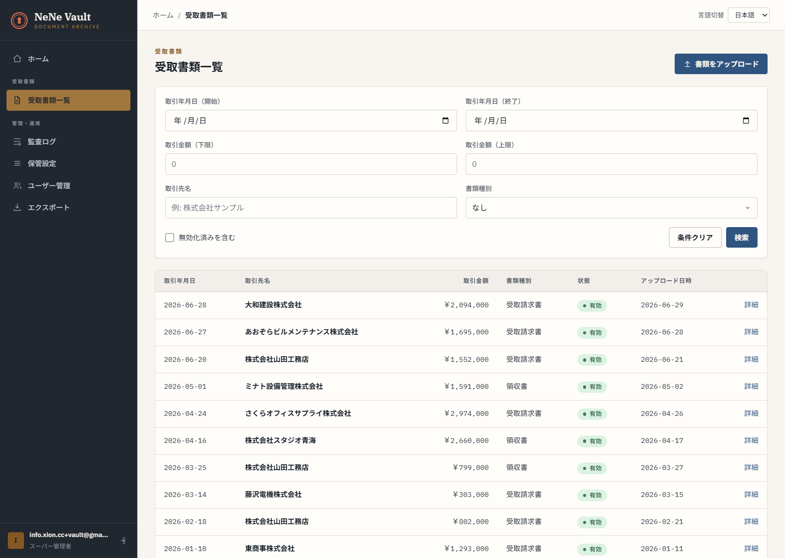
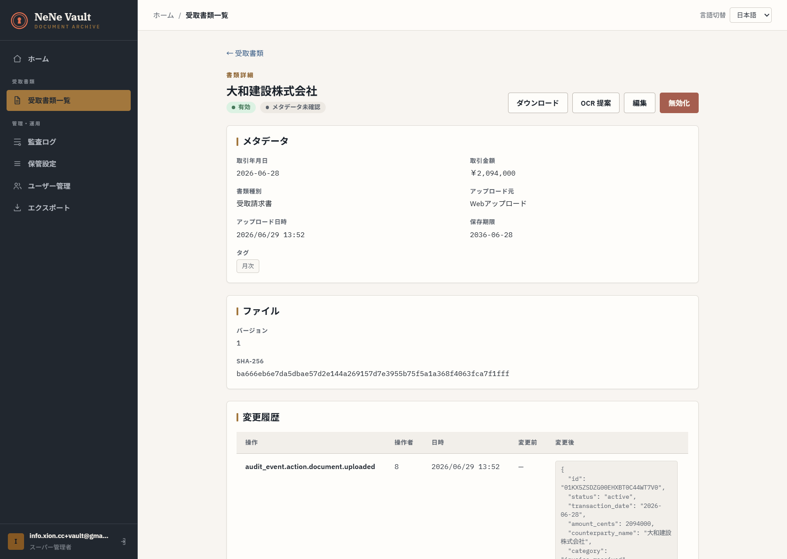
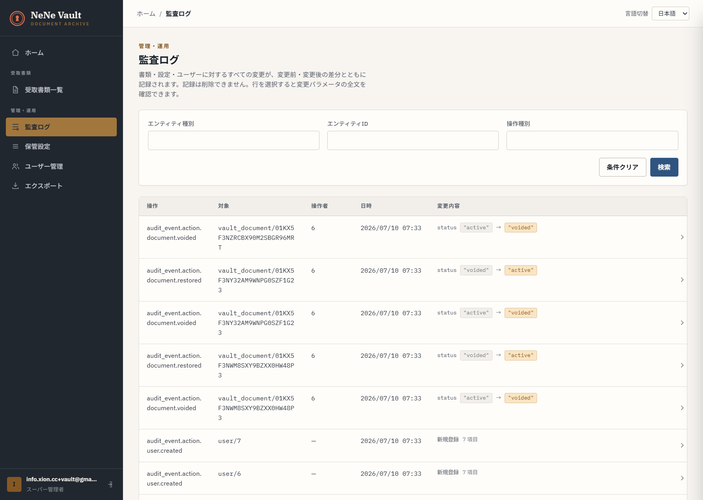
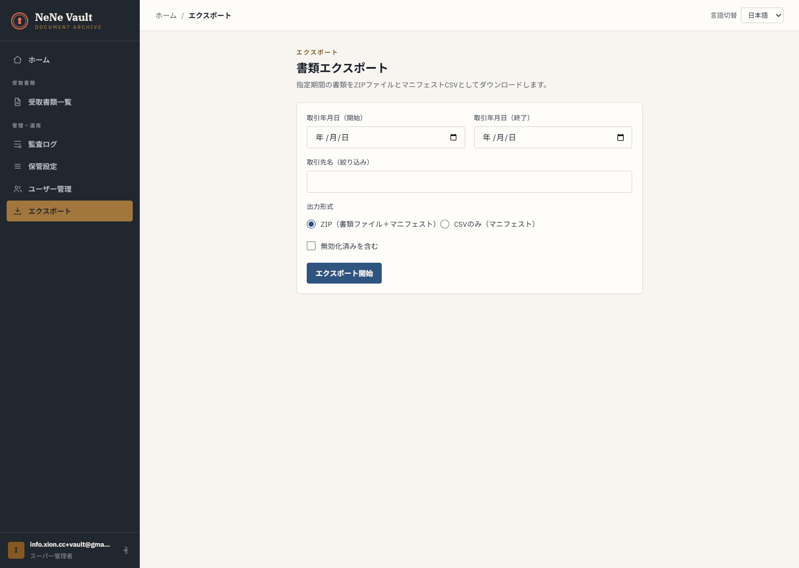
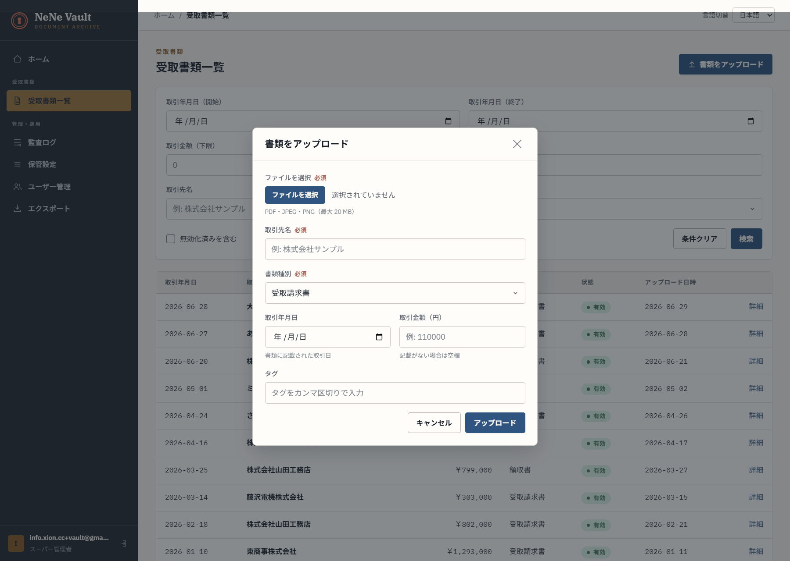

# NeNe Vault

[](./LICENSE)
[](https://www.php.net/)

**Received-document archive — self-hosted for Japan SMB.**

**NeNe Vault** stores, searches, and preserves **received** business documents
(invoices, contracts, receipts from vendors) for **電子帳簿保存法** compliance —
without becoming accounting software or expense workflow. Built on
[NENE2](https://github.com/hideyukiMORI/NENE2), shared hosting or Docker.

> **Separate product.** Vault does **not** issue quotes/invoices ([`nene-invoice`](https://github.com/hideyukiMORI/nene-invoice)),
> reconcile bank deposits ([`nene-clear`](https://github.com/hideyukiMORI/nene-clear)),
> or normalize bank CSV ([`nene-profile`](https://github.com/hideyukiMORI/nene-profile)).
> See [ADR 0009](./docs/adr/0009-separate-from-billing-and-reconciliation.md).

## Domain (binding)

| Product | Repository | What it does |
| --- | --- | --- |
| **NeNe Invoice** | `nene-invoice` | Quote, invoice, payment management — 見積・請求・入金管理 |
| **NeNe Clear** | `nene-clear` | Payment reconciliation & dunning — 入金消込・督促管理 |
| **NeNe Profile** | `nene-profile` | Bank CSV column mapping & normalization |
| **NeNe Vault** | `nene-vault` (this) | Received-document archive — 受取書類の保存・検索 |

## Live demo

Try it now — no sign-up. The link provisions a **private, disposable demo organization** pre-loaded with a year of received invoices and receipts, and seats you as its **admin** — so you can upload, void/restore, and export for real. Nothing you do affects anyone else: the organization is destroyed automatically after a few hours, and opening the link again starts a brand-new one.

- <https://vault.ayane.co.jp/demo/standard>

A shared, read-only showcase organization (reset nightly) also exists at [`/demo/guided`](https://vault.ayane.co.jp/demo/guided) for guided walkthroughs — the screenshots below are from it.

### Screenshots

Japanese UI shown — the admin UI is bilingual (ja/en, one-click switch).

**Received documents — every uploaded invoice and receipt tracked by date, counterparty, amount, and status, with 電帳法-style search filters (date range, amount range, counterparty, document type).**



**Document detail — SHA-256 of the stored file, version number, full change history with before/after JSON, and a 10-year retention deadline computed per document.**



**Audit log — append-only record of every mutation; void → restore status transitions are shown as before/after diffs and can never be deleted.**



**Export — download a date range of documents as a ZIP with a manifest CSV (or manifest-only CSV), voided documents optional.**



**Upload — PDF/JPEG/PNG up to 20 MB, with required counterparty and document-type metadata captured at ingest.**



## Goals

- **Store received documents** — PDF/image upload, metadata, immutable audit trail
- **Search (検索要件)** — date, amount, counterparty; combinations for 電帳法 visibility
- **Retention** — 7–10 year policy; no silent purge
- **Compliance as structure** — binding rules in [`received-document-compliance.md`](./docs/explanation/received-document-compliance.md)
- **Self-hosted OSS** — MIT; Tier A shared hosting or Tier B Docker/VPS
- **Optional links** — HTTP reference to Invoice/Clear entities; **no shared DB**
- **No third-party product names** in repository docs — [ADR 0013](./docs/adr/0013-no-third-party-product-names.md)
- **UI: Japanese + English only** — [ADR 0005](./docs/adr/0005-ui-language-scope-ja-en.md)

## Documentation (read first)

| Topic | Document |
| --- | --- |
| **Scope contract (GOAL / DO / DON'T)** | [`docs/explanation/scope-contract.md`](./docs/explanation/scope-contract.md) |
| **Domain boundary** | [`docs/explanation/scope-boundary.md`](./docs/explanation/scope-boundary.md) |
| **Product vision** | [`docs/explanation/product-vision.md`](./docs/explanation/product-vision.md) |
| **Requirements** | [`docs/explanation/requirements.md`](./docs/explanation/requirements.md) |
| **Compliance (binding)** | [`docs/explanation/received-document-compliance.md`](./docs/explanation/received-document-compliance.md) |
| **Sibling integration** | [`docs/integrations/sibling-products.md`](./docs/integrations/sibling-products.md) |
| **Agents** | [`AGENTS.md`](./AGENTS.md) |
| **Roadmap** | [`docs/roadmap.md`](./docs/roadmap.md) |

## Quick start (Docker)

> **Tier A (shared hosting):** deploy without Docker via the web installer —
> build a release ZIP with `tools/build-release.sh` (or download one from GitHub
> Releases), upload it, and open `install.php`. See
> [`docs/operator/installation.md`](./docs/operator/installation.md).

```sh
composer install            # once, on the host — installs NENE2 ^1.10 from Packagist
cp .env.example .env        # customise ADMIN_EMAIL / ADMIN_PASSWORD if desired
docker compose up           # SQLite (default) + Vite dev server
```

Then open:

| Service  | URL                     | Notes                                  |
|----------|-------------------------|----------------------------------------|
| Frontend | http://localhost:5186   | Vite dev server (proxies API to `app`) |
| API      | http://localhost:8600   | Apache + PHP 8.4                        |

First-run admin credentials come from `.env` (`ADMIN_EMAIL` / `ADMIN_PASSWORD`,
default `admin@example.com` / `changeme123`). A `default` organization, its
vault settings, and a superadmin user are seeded automatically.

**MySQL instead of SQLite:**

```sh
docker compose --profile mysql -f docker-compose.yml -f docker-compose.mysql.yml up
```

## Local ports

NeNe Vault owns the **"86" port lane**; sibling products use their own lanes so several apps can run locally side by side (full policy: [`CLAUDE.md`](./CLAUDE.md#local-ports-fixed-86-lane)). Override via `NENE_VAULT_*` env vars in `.env`.

| Service          | Port  | Env var                     |
|------------------|-------|------------------------------|
| API (Apache/PHP) | 8600  | `NENE_VAULT_PORT`           |
| Frontend (Vite)  | 5186  | `NENE_VAULT_FRONTEND_PORT`  |
| MySQL            | 3386  | `NENE_VAULT_MYSQL_PORT`     |

Container-internal ports (8080 / 5173 / 3306) are unchanged; only the host side
differs. If you must temporarily override (e.g. running two Vault checkouts),
set the env vars — but keep `.env` on the fixed allocation above:

```sh
NENE_VAULT_PORT=8601 NENE_VAULT_FRONTEND_PORT=5187 docker compose up
```

## Status

**All roadmap phases (0–4) complete; compliance gate approved.** See
[`docs/roadmap.md`](./docs/roadmap.md) and [`docs/todo/current.md`](./docs/todo/current.md).

| Phase | Scope | Status |
| --- | --- | --- |
| 0 | Governance & foundation — ADRs, scope contract, NENE2 scaffold | ✅ Complete |
| 1 | Document API — auth, multi-tenancy, upload/search/void/restore/history, SHA-256 download, audit logging, CSV export | ✅ Complete |
| 2 | Admin UI + Export — React/Vite pages, ja/en UI, frontend tests, Docker dev env, export ZIP | ✅ Complete |
| 3 | Tier A shared hosting — web installer + release ZIP, operator guide, 事務処理規程 template | ✅ Complete |
| 4 | Ecosystem — MCP read/write tools, S3-compatible storage, email inbound, OCR assist | ✅ Complete |

**Compliance gate: 🟢 Approved** — licensed 税理士 sign-off recorded 2026-05-31
(Review 2, [`docs/compliance-review/signoff-record.md`](./docs/compliance-review/signoff-record.md)).

**Remaining before production go-live:** pre-production 税理士 Review 3 and
Tier A live testing on real shared hosting — see
[`docs/todo/current.md`](./docs/todo/current.md).

## Ecosystem

```
NENE2 (framework)
  ├── NeNe Invoice   (issued billing documents)
  ├── NeNe Clear     (reconciliation · dunning)
  ├── NeNe Profile   (bank CSV normalization)
  └── NeNe Vault     (received-document archive)  ← this repo
```

## License

MIT — see [LICENSE](./LICENSE).
