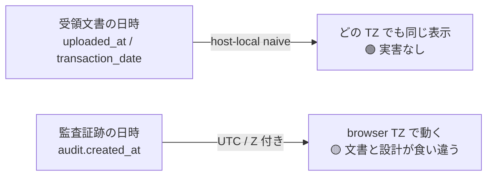

# #228 タイムゾーン — 施主 即断パッケージ（E-4 live 実証）

**目的**: #228（監査は UTC・文書は host-local の混在）を、QA の live 実証エビデンスとセットで施主が1分で判断するための1枚。
**日付**: 2026-07-21 ／ **実証**: live-target Playwright（`tests/e2e/live/batch4-e4-fixedorg.spec.ts`・guided 固定org）
**関連**: Issue #228 / QA 仕様書 `docs/qa/2026-07-21-demo-keystroke-qa.md` §3 バッチ4

---

> ## ✅ 施主裁定（2026-07-21 夜・hide）: **案A 確定**
> **現状維持＋注記のみ**。文書=host-local／監査=UTC の設計差は許容。表示実害が無いこと（下記 live 実証）を注記で残す。B（表示正規化）・C（保存正規化）は **W3 再生成時の再検討候補として台帳注記のみ**。admin レーンの監査 E-4 追加実証は本裁定につき**不要**（§4 記載どおり）。→ これで #228 は解決、vault C1 クローズ。

## 1. 結論（先に）

- 🟢 **文書の日時（uploaded_at・transaction_date）はブラウザのタイムゾーンで動かない**＝どの地域の相手が見ても同じ表示。**表示上の実害は現状なし**。
- 🟡 **監査証跡（audit の日時）だけは UTC 基準で、文書時刻（host-local）と設計が食い違う**。監査画面を跨ぐと「同じ出来事なのに時刻系が違う」余地がある（admin のみ閲覧）。
- ⚖️ **判断が要るのは「この設計差（文書=host-local／監査=UTC）を許容するか、片方に正規化するか」の1点だけ**。

---

## 2. live 実証で分かったこと（誤解の訂正込み）

| 項目 | 実測（同一文書を UTC と JST の両ブラウザで開く） | 意味 |
|---|---|---|
| 文書 `uploaded_at` | UTC でも JST でも **`07/13/2026, 11:22 AM`（完全一致）** | host-local **naive**（Z なし）→ parse も format も browser-local で wall-clock 不変＝**TZ で動かない** |
| `transaction_date`・保存期限 | 両方 **`2026-07-12`（一致）** | 生 ISO 日付＝元から TZ 非依存 |
| 監査 `created_at` | （viewer 不可視・admin レーンで別途実証） | UTC 保存（`Z` 付き）＝**これは browser TZ で動く**＝文書時刻と混在の唯一の火種 |

> **訂正**: 当初バッチ1で「文書時刻が TZ で動く」と観測したのは、別々の使い捨て org の**別文書**同士を比較した誤り。guided 固定org で**同一文書**を2 TZ で開いて否定した（上表）。

---

## 3. 施主の判断（どれか1つ）

| 案 | 内容 | 影響 | 工数感 |
|---|---|---|---|
| **A. 現状維持（許容）** | 文書=host-local／監査=UTC のまま。表示実害が無いので触らない | 監査と文書を並べる画面で時刻系が異なる旨だけドキュメント注記 | 最小（注記のみ） |
| **B. 表示を片側へ正規化** | 監査時刻も「文書と同じ host-local 表示」に寄せる（or 全て UTC 表示に統一） | 全日時表示の一貫性が上がる。監査の法的原本は UTC のまま・表示のみ変換 | 中（`formatDateTime` の TZ 方針を1本化＋監査表示の変換） |
| **C. 保存を正規化** | 文書時刻も UTC 保存に統一（naive をやめる） | 設計はきれいだが電帳法上の「文書日付＝host-local の意味」を再確認要・移行コスト大 | 大（migration・#161 系と連動） |

**推し（vault リナ意見・非拘束）**: 表示実害が無い現状、**A（注記して現状維持）** で C1 の栓を抜き、B は W3/意匠レーンの改善候補として台帳へ。C は電帳法解釈を要するので単独で走らせない。

---

## 4. 添付エビデンス

- 実証コード: `tests/e2e/live/batch4-e4-fixedorg.spec.ts`（PASS・trace/screenshot は `playwright-report-live`）
- 生ログ: doc `01KY0G3FFCYRJVJ7KRVE9NER2F` の UTC/JST 一致（§3 バッチ4）
- 残実証（admin レーン・standard mint 回復後）: 監査 `created_at` が UTC で動くことの live 実証（B/C 判断の裏取り）。**A を選ぶなら不要**。
